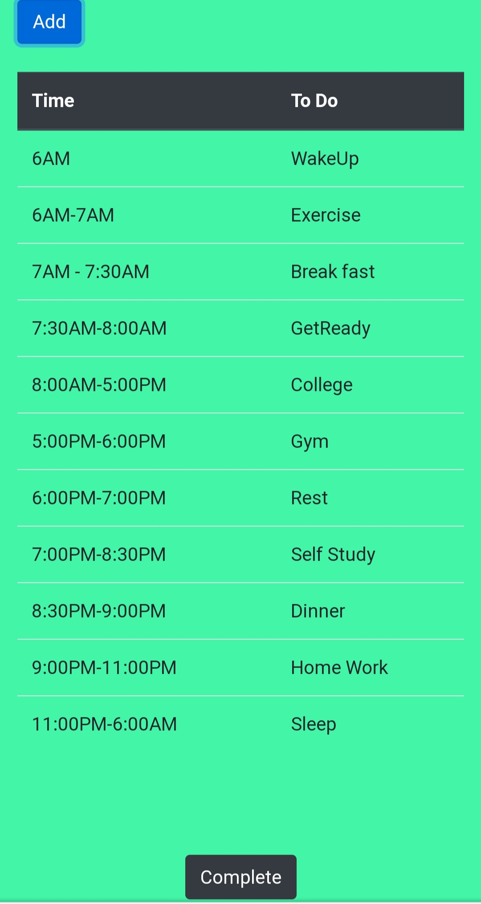

# MyTimeTable
It's a good habit to plan your next day before going to bed! So I've made a simple time table project in which you can add 'on what time, what you want to do'. I've used html, css and javascript for this purpose.

.
 <a href="https://rohit-bindal.github.io/MyTimeTable/"> <h1> Live Demo </h1></a>  
 

 An image of a sample timetable made from MyTimeTable 

 

